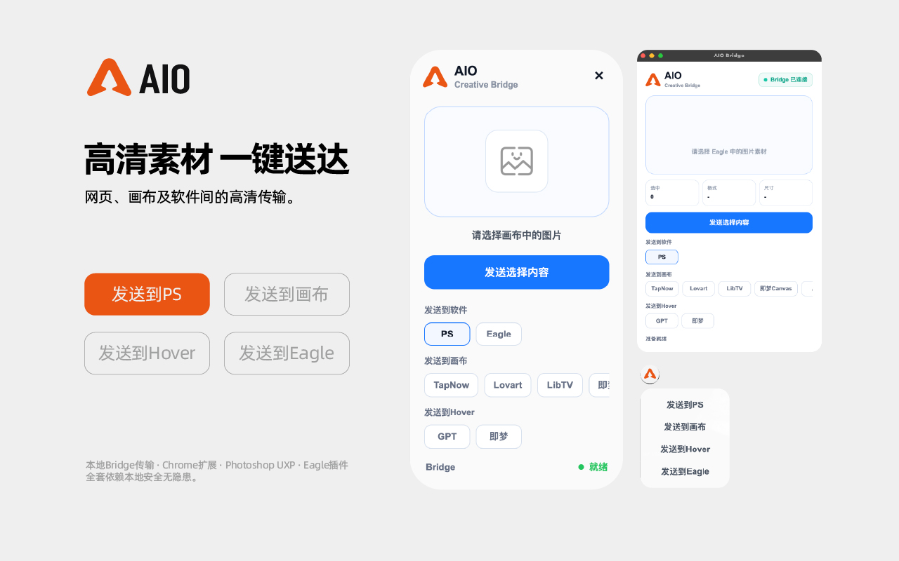

# AIO Bridge

## 高清素材一键送达

AIO Bridge 是一款本地创意工作流工具，用于在网页、Photoshop、Eagle 与 AI 画布之间快速传输图片与视频素材。

它通过本地 Bridge 服务连接 Chrome 扩展、Photoshop UXP 插件、Eagle 插件与桌面端。用户主动选择图片或视频后，即可发送到支持的目标软件、画布或 AI 对话场景，减少重复下载、保存、导入和上传。

## 核心功能

- **网页图片直达 Photoshop**  
  在网页图片上点击 AIO 悬浮按钮，即可把当前图片发送到 Photoshop，并自动导入为新图层。

- **图片与视频收藏到 Eagle**  
  浏览素材站、Pinterest 或 AI 创作平台时，遇到合适的图片或视频可以直接发送到 Eagle 素材库。

- **素材发送到 AI 画布**  
  支持将网页和 Eagle 中的图片、视频，以及 Photoshop 图层发送到 TapNow、Lovart、LibTV、即梦 Canvas 等画布工具。

- **素材发送到 AI 对话**  
  将图片或受支持的视频发送到 Hover 或对话场景，用于内容分析、提示词生成、参考讨论或创意延展。

- **Photoshop 图层一键发送**  
  在 Photoshop 中选择当前图层，即可发送到网页画布、AI 对话或 Eagle，适合继续生成和二次创作。

- **Eagle 素材连接创作流**  
  在 Eagle 中选择图片或视频素材，即可发送到支持的软件、网页画布或 AI 对话，让素材库成为创作中枢。

## 隐私政策

请查看 GitHub Pages 首页中的完整隐私政策说明。

## 下载地址
https://pan.baidu.com/s/1hGy6nlp7f9jvB_Tw5VbMbw?pwd=wsh8
